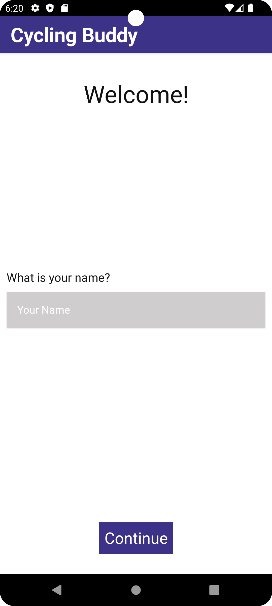
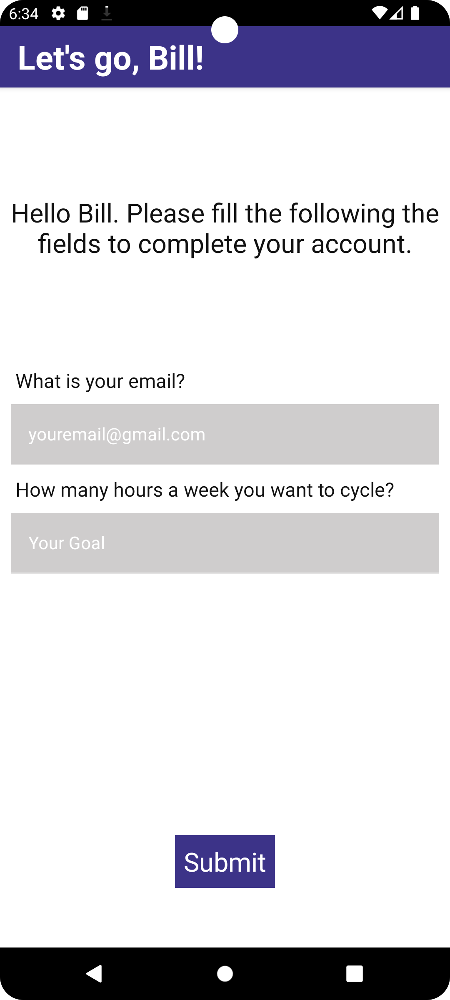
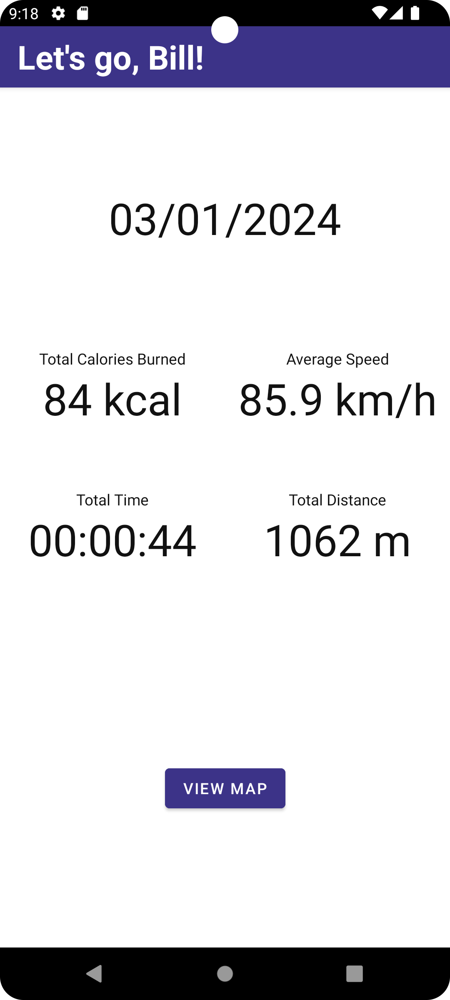
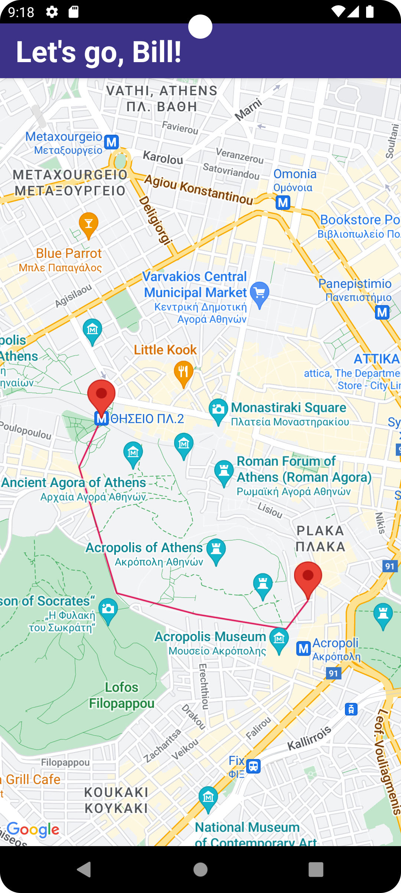
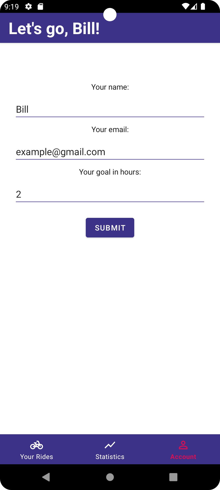
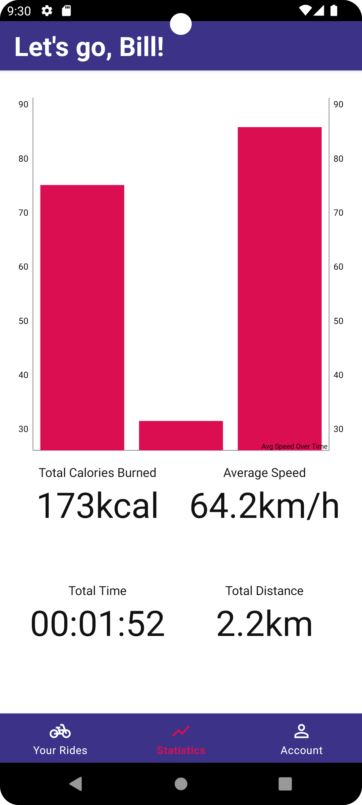
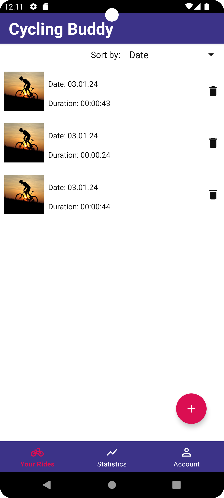

# CyclingBuddy
An android app to keep track of your cycling trips.

## Requirements
- Writen in Kotlin
- Create user account
- Create a database of cycling trips
- Store data of date, time, distance, average spped, calories burned for each trip
- User is able to order trips by those categories
- Show the stats of all the trips (average speed, total distance, total calories burned, total time of cycling)
- Show the data of every trip and a map of the trip's route 

## Tools used
- Android Studio IDE
- Room
- Dagger Hilt
- Google Maps Location Services
- MPAndroidChart

# Screenshots

  
   
   
   
   
   
   

